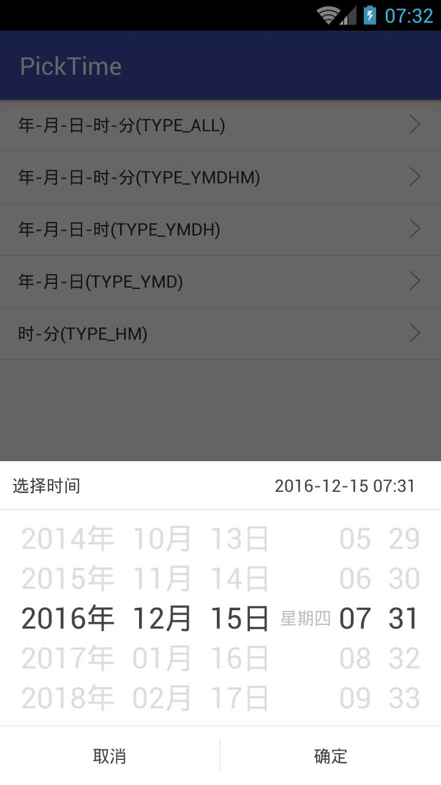
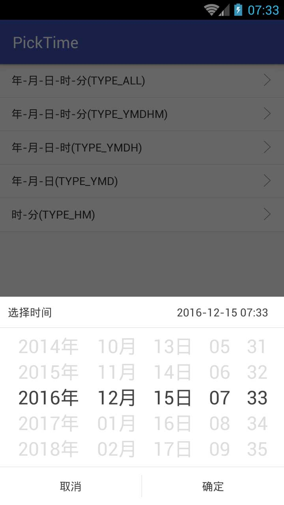
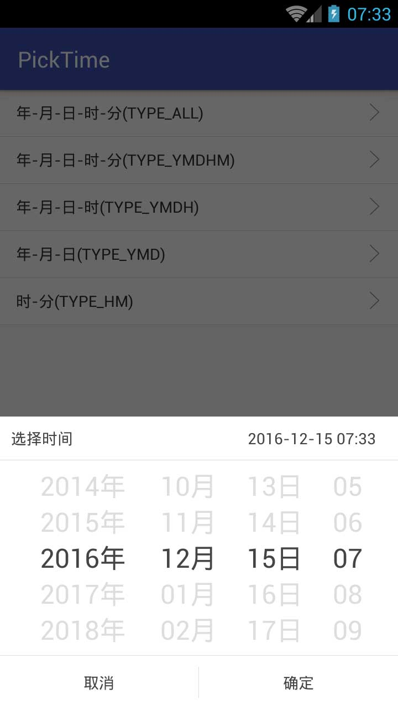
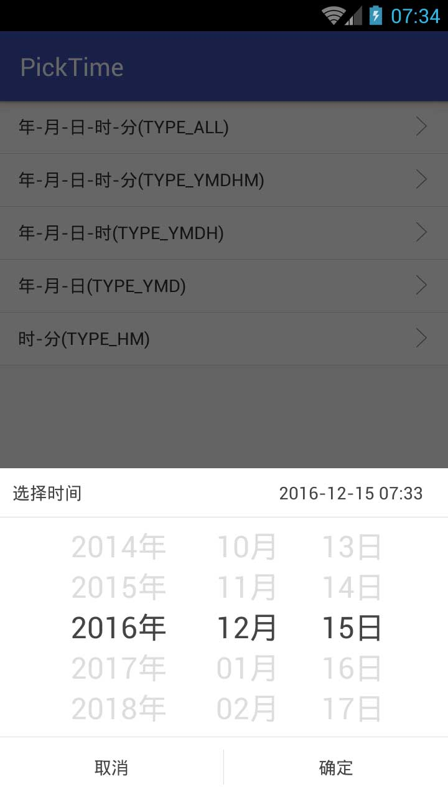
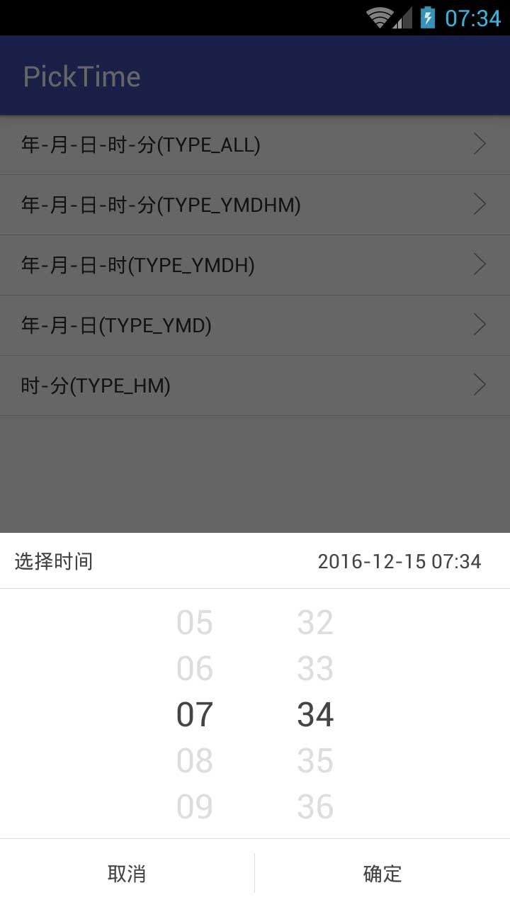
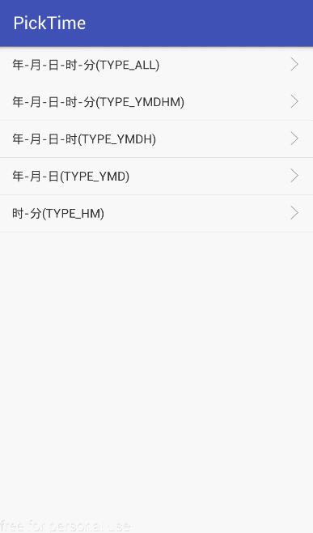

# PickTime
## 日期选择控件 ##

[](https://jitpack.io/#codbking/PickTime)

 [**apk下载**](https://raw.githubusercontent.com/codbking/PickTime/master/app-debug.apk)

### 截图
------------------

|TYPE_ALL|TYPE_YMDHM|TYPE_YMDH|TYPE_YMD|TYPE_HM|
|:--:|:--:|:--:|:--:|:--:|
||||||
<!---->
<!---->
<!---->
<!---->
<!---->

### 效果
-------------



### DateType

- TYPE_ALL--年、月、日、星期、时、分
- TYPE_YMDHM--年、月、日、时、分
- TYPE_YMDH--年、月、日、时
- TYPE_YMD--年、月、日
- TYPE_HM--时、分

### how to use

 - **Add it in your root build.gradle at the end of repositories:**

```
	    allprojects {
		   repositories {
			...
			maven { url 'https://jitpack.io' }
		}
	    }
```

 -  **Add the dependency**
```sh
	dependencies {
	        compile 'com.github.codbking:PickTime:v1.0.1'
	}
```

 -  **java**
```java
        DatePickDialog dialog = new DatePickDialog(this);
        //设置上下年分限制
        dialog.setYearLimt(5);
        //设置标题
        dialog.setTitle("选择时间");
        //设置类型
        dialog.setType(DateType.TYPE_ALL);
        //设置消息体的显示格式，日期格式
        dialog.setMessageFormat("yyyy-MM-dd HH:mm");
        //设置选择回调
        dialog.setOnChangeLisener(null);
        //设置点击确定按钮回调
        dialog.setOnSureLisener(null);
        dialog.show();
```


